# 1701QCA Final project journal: Connor Brown

<!--- As for other assessments, fill out the following journal sections with information relevant to your project. --->

<!--- Markdown reference: https://guides.github.com/features/mastering-markdown/ --->

## Related projects ##
<!--- Find about 6 related projects to the project you choose. A project might be related through  function, technology, materials, fabrication, concept, or code. Don't forget to place an image of the related project in the appropriate folder and insert the filename in the appropriate places below. Copy the markdown block of code below for each project you are showing. --->

### Related project 1 - How to make a Wooden Katana from hardwood flooring // Woodworking###

https://www.youtube.com/watch?v=2nshBD9EbxE

I intially intended to use this video as a guide to creating my prop sword, however without access to woodworking equipment I was unable to use wood as my material.

### Related project 2 - Demon Slayer / Kimetsu No Yaiba LED Katana DIY kit ( TUTORIAL )###

https://www.youtube.com/watch?v=WLo4PAFPa8E&t=334s

This video is partially what inspired me to make a glowing sword prop using acrylic for the blade. My version will be much larger and complex.

### Related project 3 - Light Katana (Making Of)###

https://www.youtube.com/watch?v=tGIxBVOW96M

Similar to the previous related project this video also shows the making of a LED lit sword prop.

### Related project 4 - The PVC Katana Build-Along###

https://www.youtube.com/watch?v=IH5fNfSK_3U

This project shows how to make a sword using PVC piping. I plan to only use PVC on my hilt and possibly handguard.

### Related project 5 - Katana tutorial - Samurai sword [How to make props]###

https://www.youtube.com/watch?v=5YrxfzWIe28

This project uses EVA Foam to create a katana sword prop. This is my backup plan if Acrylic proves too difficult to use.

### Related project 6 -【Demon Slayer】Making Shinazugawa Zenitsu's Nichirin Sword 【Kimetsu No Yaiba】A Black Blade きめつのやいば 鬼滅###

https://www.youtube.com/watch?v=wd_aL04VJHs&t=352s

This project uses wood and electricity to create a super cool lightning design on a sword, and then the design is filled with a glow in the dark powder.

## Other research ##
<!--- Include here any other relevant research you have done. This might include identifying readings, tutorials, videos, technical documents, or other resources that have been helpful. For each particular source, add a comment or two about why it is relevant or what you have taken from it. You should include a reference or link to each of these resources. --->

To learn how to use the new tools I purchased from Bunnings I watched several youtube videos explaining how they work, and luckily everything went okay and I did not injure myself in the process of creating my project. I also looked into changing the shape of PVC piping, however this aspect of my design did not work out how I had intended. 

## Conceptual development ##

### Design intent ###
<!--- Include your design intent here. It should be about a 10 word phrase/sentence. --->
Design intent
My design intent is to create a cosplay sword prop that incoporates the microbit. I plan to add lights and sounds.

### Design ideation ###
<!--- Document your ideation process. This will include the design concepts presented for assessment 2. You can copy and paste that information here. --->
### Design concept 1###
Initially I wanted to create my sword prop from wood using the laser cutter and workshop, however due to the Covid-19 pandemic this is no longer possible for me. I tried reaching out to some friends of friends that I knew did woodworking but I couldn't find anybody willing to let me use their workshop.

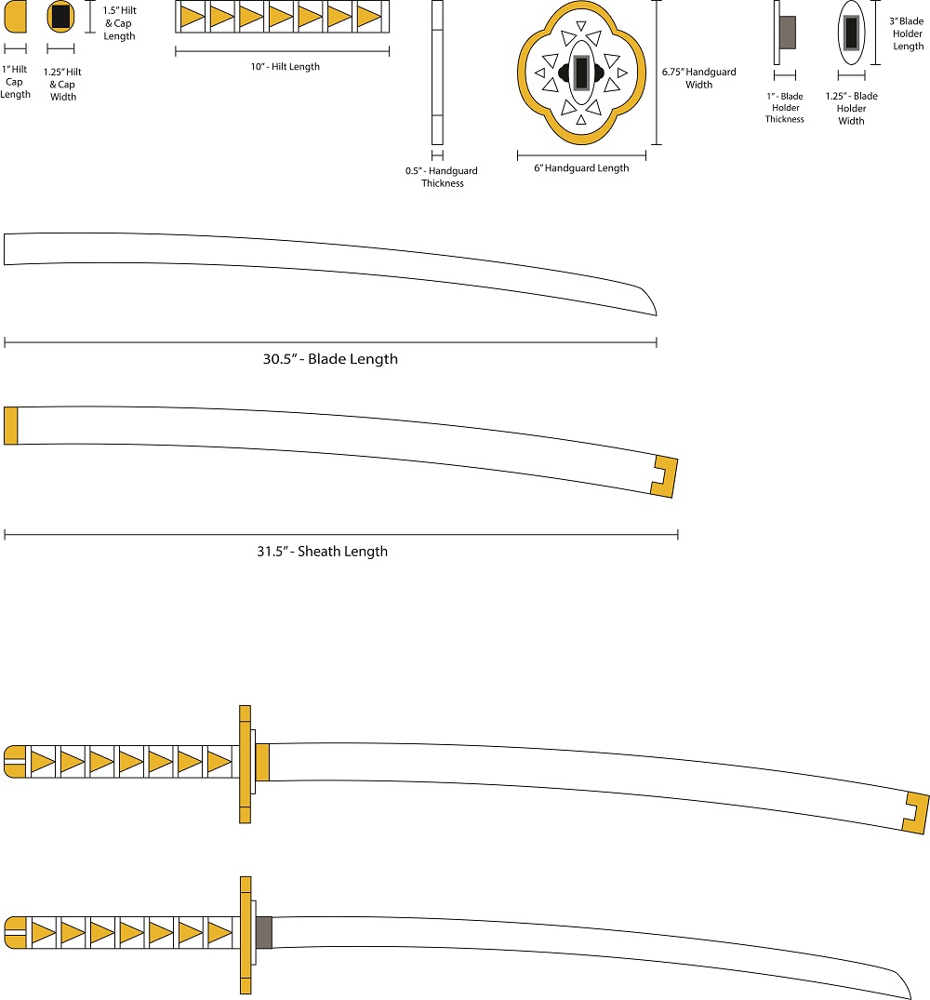

### Design concept 2 ###
My second idea was to create the sword mostly out of foam. While this would likely be the cheapest and easiest method I feel it wouldn't turn out the best and would be very delicate.

### Final design concept ###
<!--- This should be a description of your concept including its context, motivation, or other relevant information you used to decide on this concept. --->
My final decision was to use plastic for most of the sword design. For the hilt I plan to use PVC piping. This works well as I plan to store my battery packs inside the hilt, and the PVC pipes are already hollow. For the handguard and blade I intend to use acrylic either painted or covered in foam. My LED Strip will run up the back of the blade. I will cover the blade and cut out a lightning design along the sides, so when the LED strip is turned on the light will pass through the acrylic and shine out of the lightning.

### Interaction flowchart ###
<!--- Include an interaction flowchart of the interaction process in your project. Make sure you think about all the stages of interaction step-by-step. Also make sure that you consider actions a user might take that aren't what you intend in an ideal use case. Insert an image of it below. It might just be a photo of a hand-drawn sketch, not a carefully drawn digital diagram. It just needs to be legible. --->

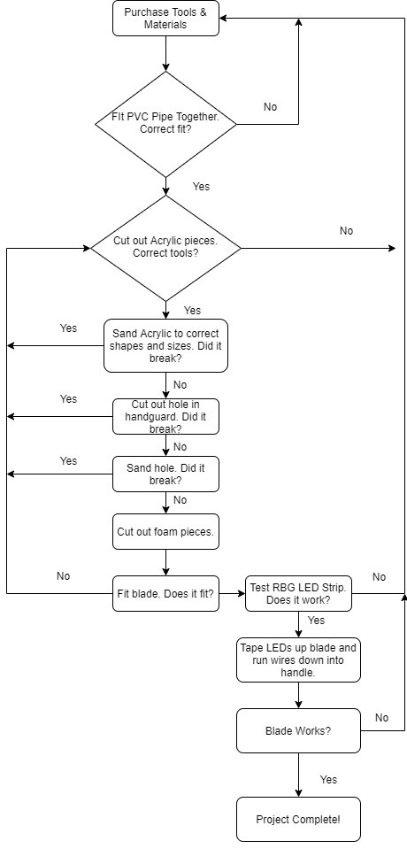

## Process documentation ##
<!--- In this section, include text and images (and potentially links to video) that represent the development of your project including sources you've found (URLs and written references), choices you've made, sketches you've done, iterations completed, materials you've investigated, and code samples. Use the markdown reference for help in formatting the material.

There will likely by a dozen or so images of the project under construction. The images should help explain why you've made the choices you've made as well as what you have done. --->

To start off with I had to purchase the supplies to create my project. I visited Bunnings and purchased several materials & tools including a Jigsaw, Hacksaw, Drill, PVC piping, a large sheet of clear Acrylic, sandpaper, and RBG strip lights. I then visited Spotlight and purchased coloured foam, coloured paper, a hot glue gun, blackboard tape.

Once I had everything I needed, I got started putting my project together. Firstly I cut down my PVC piping to about forearms length to use for the handle. I tried to form it into a more oval shape by heating it with a hairdryer and then pressing it down with my bodyweight and a large textbook, however this was unsuccessful and led to it being squished beyond use. Luckily I was able to cut several pieces from the large PVC pipe I purchased, and after a few attempts opted to just remain with a round handle. 

After choosing to keep the handle round I sanded down one end slightly and fit the PVC cap on to use for removing the battery. By sanding the end of the pipe it loosened it a little bit, making it easier to remove and refit. I then fit on the top piece of PVC to use for holding the handguard in place.

My next step was to cut the acrylic into the blade and handguard shapes. Using my jigsaw I cut out the two rough shapes. I then sanded them down over the course of several hours to be reasonaly straight and even. Once this was done I then used my drill to make several small holes in the acrylic handguard, in order to cut a larger hole out for the PVC pipe attachment to fit through. I then sanded the inside for another few hours until the PVC pipe attachment fit through the handguard and held it in place. 

Next I went about cutting out the foam to decorate the project. I cut out two pieces of white foam in the same shape as the acrylic handguard, cut a hole in the middle of both, and glued them onto each side. I then cut out a strip of yellow foam to run around the outside of the combined piece. Next I decorated the blade by wrapping yellow paper around the handle, and taping it on. I then took another piece of white foam and cut in a repeating triangle pattern for all 4 sides, and taped this on too. Next I cut out several thing strips of white foam and taped them on inbetween the triangles.

Next I set about attaching the blade to the sword. I placed it into the opening of the PVC attachment and squished in some pieces of rubber from an old phone case, along with 4 small wooden pegs and 2 plastic pegs. Once the sword was held in place I ran the RBG strip cables through the opening and down into the handle. I stripped the cables and attached them to a long thin battery pack I purchased from Jaycar. I tested that the connection was functional, and then put the battery pack into the handle and closed it with the cap. 

Finally I ran the RBG strip up the back of the blade and taped it on with blackboard tape. I removed the battery pack again, placed in my batteries, and took a video. There is still some small adjustments and decorative aspects I would like to make to my project, but overall I am very happy with the outcome.

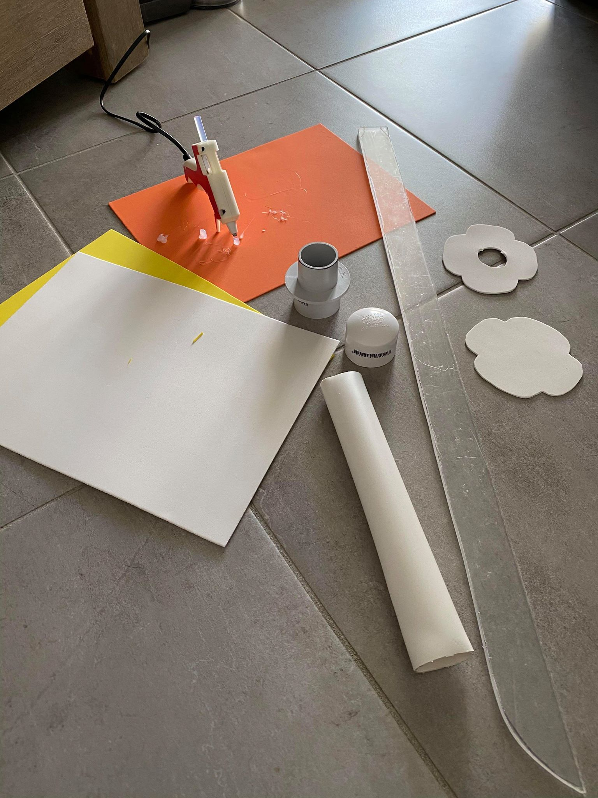

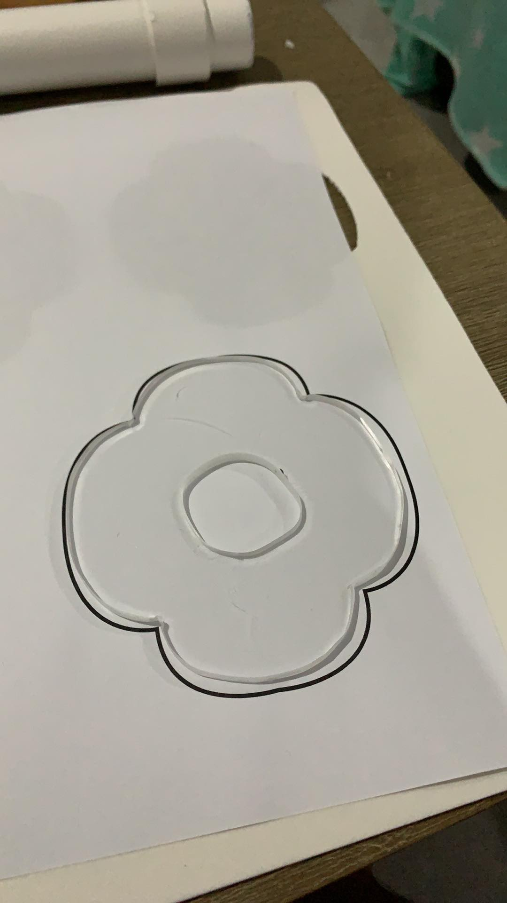

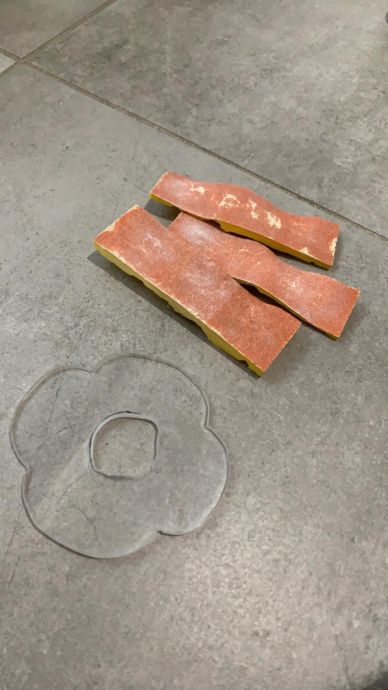	

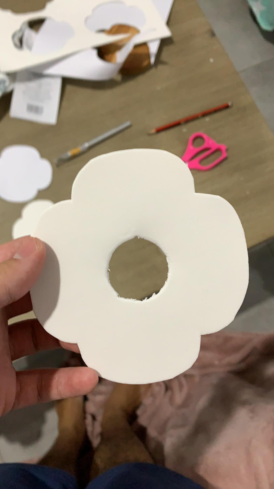	

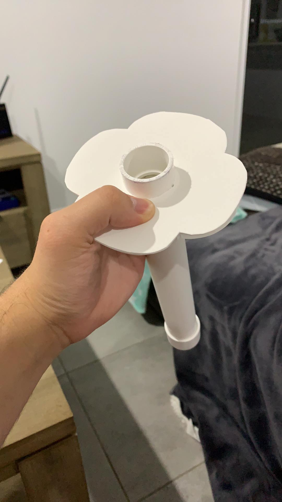	

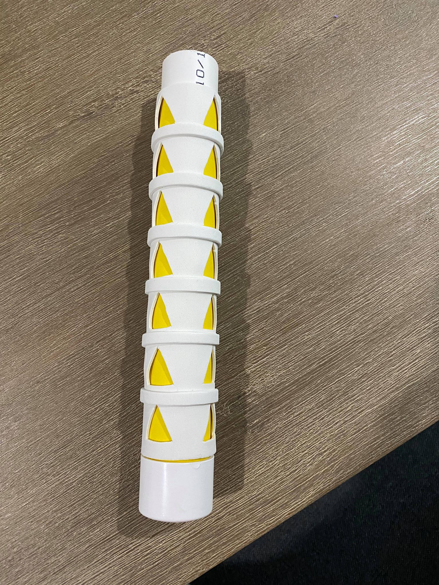

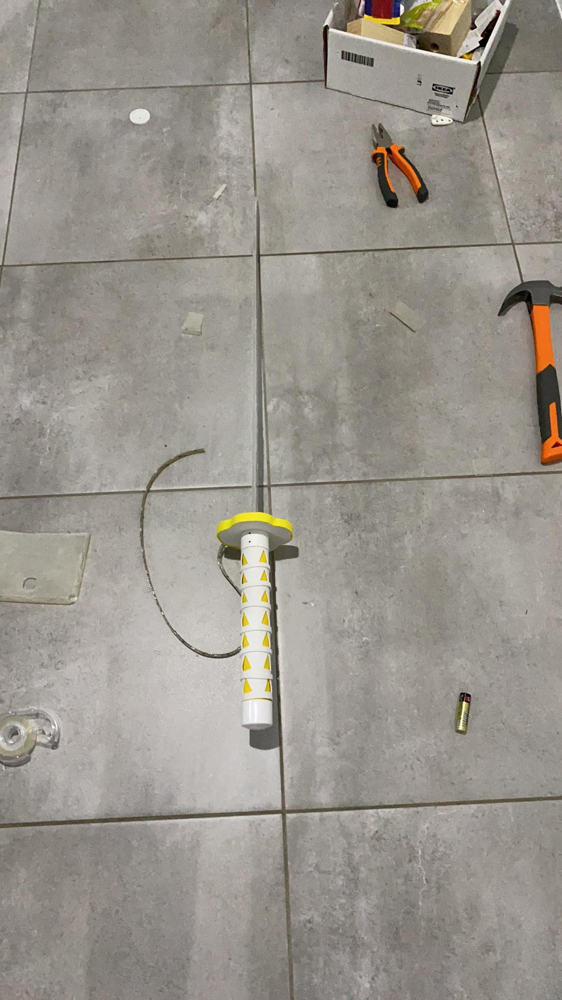

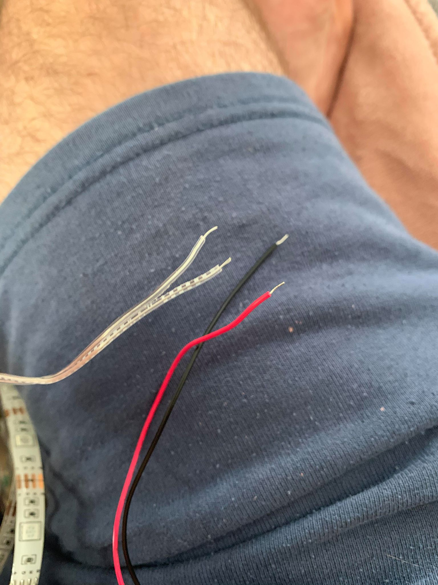	

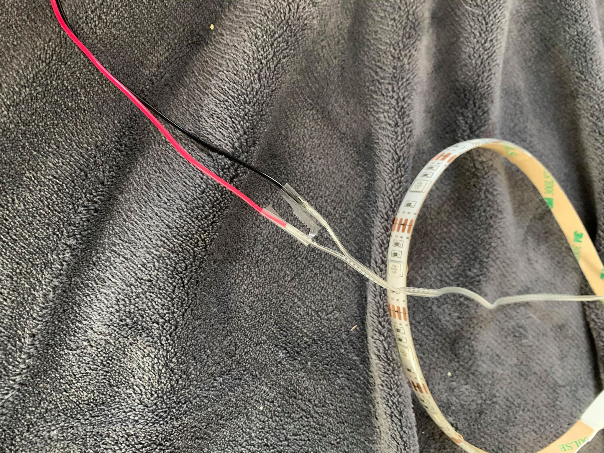

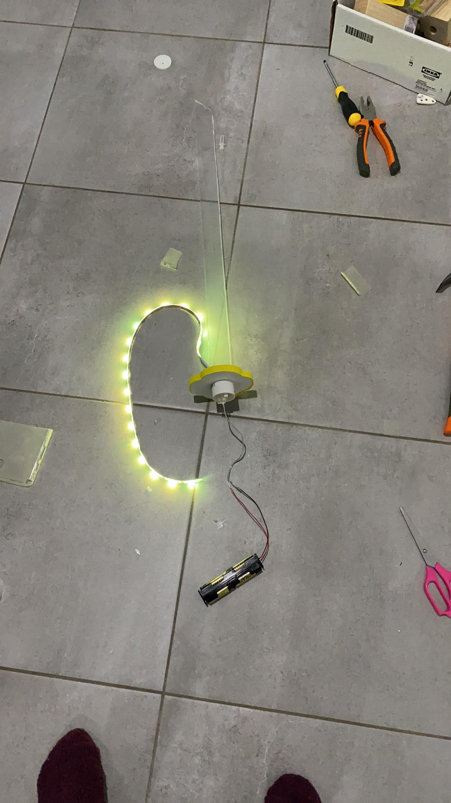

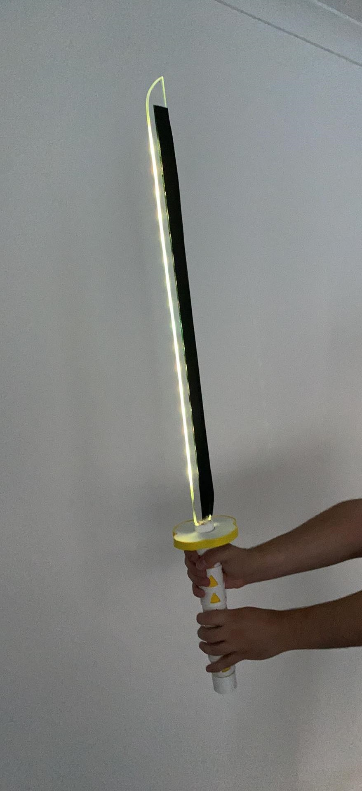

https://youtu.be/FfmzlaxbiqM

## Final Code & Circuit ##

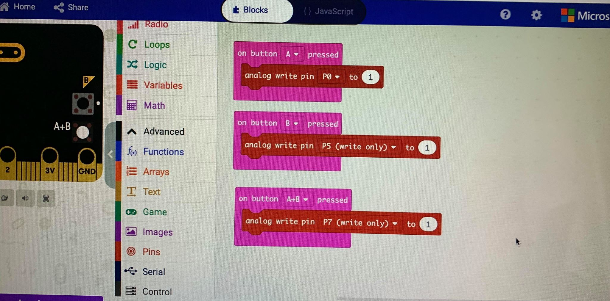
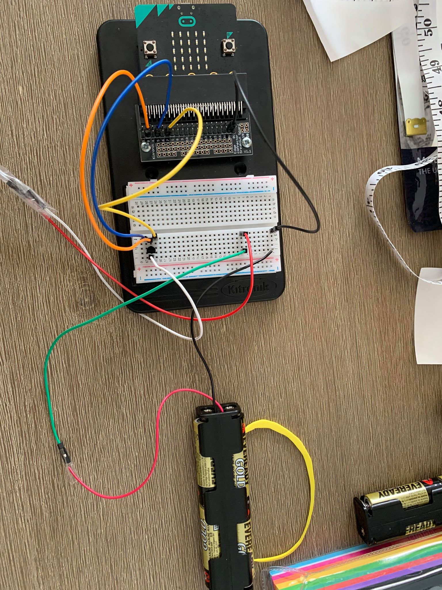
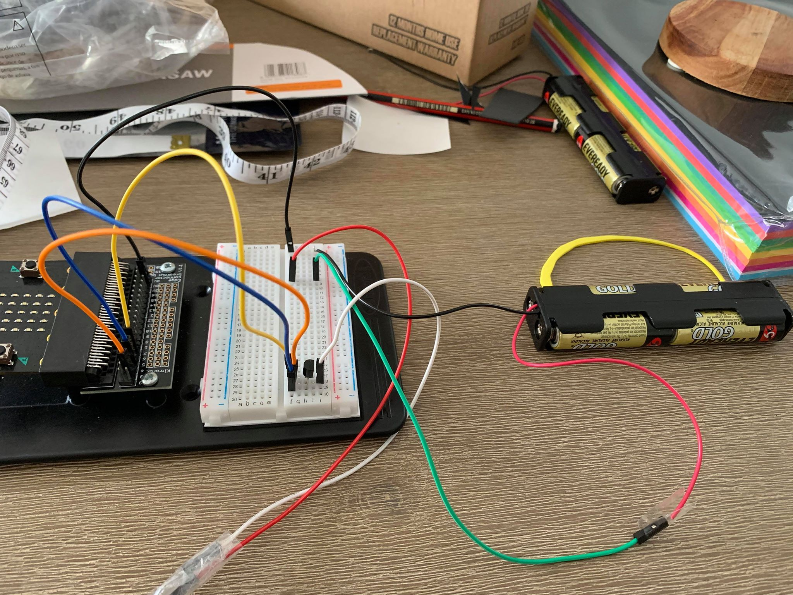

## Design process discussion ##
<!--- Discuss your process used in this project, particularly with reference to aspects of the Double Diamond design methodology or other relevant design process. --->

I began by purchasing the required tools and materials needed to create my project. Afterwards I put the handle together with PVC piping, and cut out the handguard and blade from acrylic. Next I sanded the blade and handguard to be straight and even. After that I drilled small holes into the handguard to create one large hole in the center. I then sanded down the inside of this hole until I could fit it tightly on part of the PVC handle. Next I covered the handguard and handle with coloured foam to decorate it. Afterwards I fit the blade into the handle tightly with a few small objects. I then ran the RBG LED strip cable through the hole into the handle, and attached the battery pack. Finally I taped the LED strip up the back of the blade with blackboard tape and completed my project!

## Reflection ##

<!--- Describe the parts of your project you felt were most successful and the parts that could have done with improvement, whether in terms of outcome, process, or understanding.

What techniques, approaches, skills, or information did you find useful from other sources (such as the related projects you identified earlier)?

I found techniques employed by related project 2 to be helpful and inspiring. Aspects from the other related projects also helped, and so too did youtube tutorials on how to use the tools I purchased.

What parts of your project do you feel are novel? This is IMPORTANT to help justify a key component of the assessment rubric.

The parts of my project that I feel are unique are the use of acrylic to make my sword glow and the blackboard tape for a smooth black finish. I also think that wiring my RBG LED strip into the handle with a replaceable battery pack was a smart move for continued future use.

What might be an interesting extension of this project? In what other contexts might this project be used? --->

An interesting extension to this project would be a sheath for the sword, and perhaps some sort of switch to activate the LEDs when the sword is unsheathed. I may also make an improved version out of wood in the future when the campus workshop is open and I have access to the appropriate tools.
